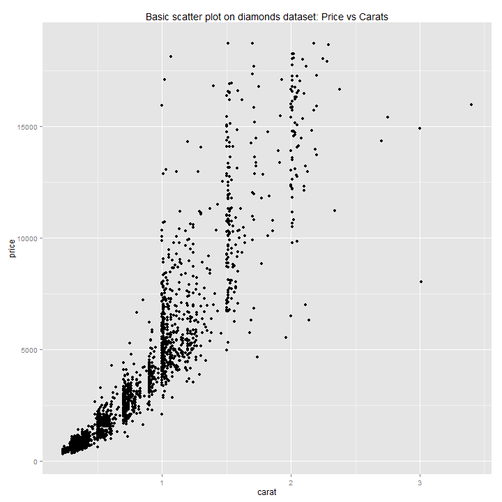
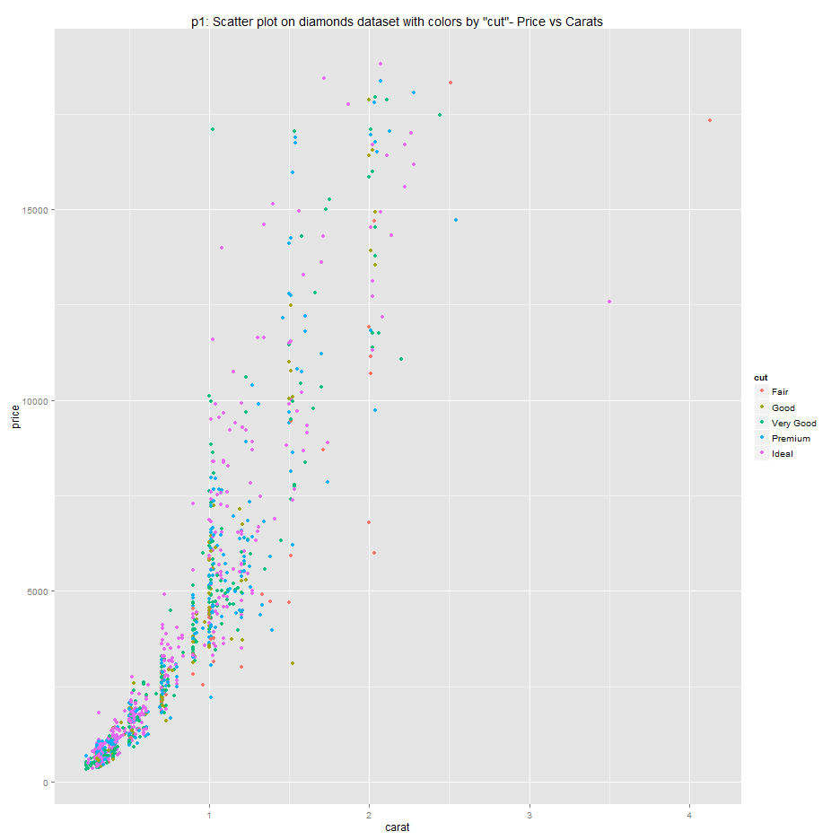
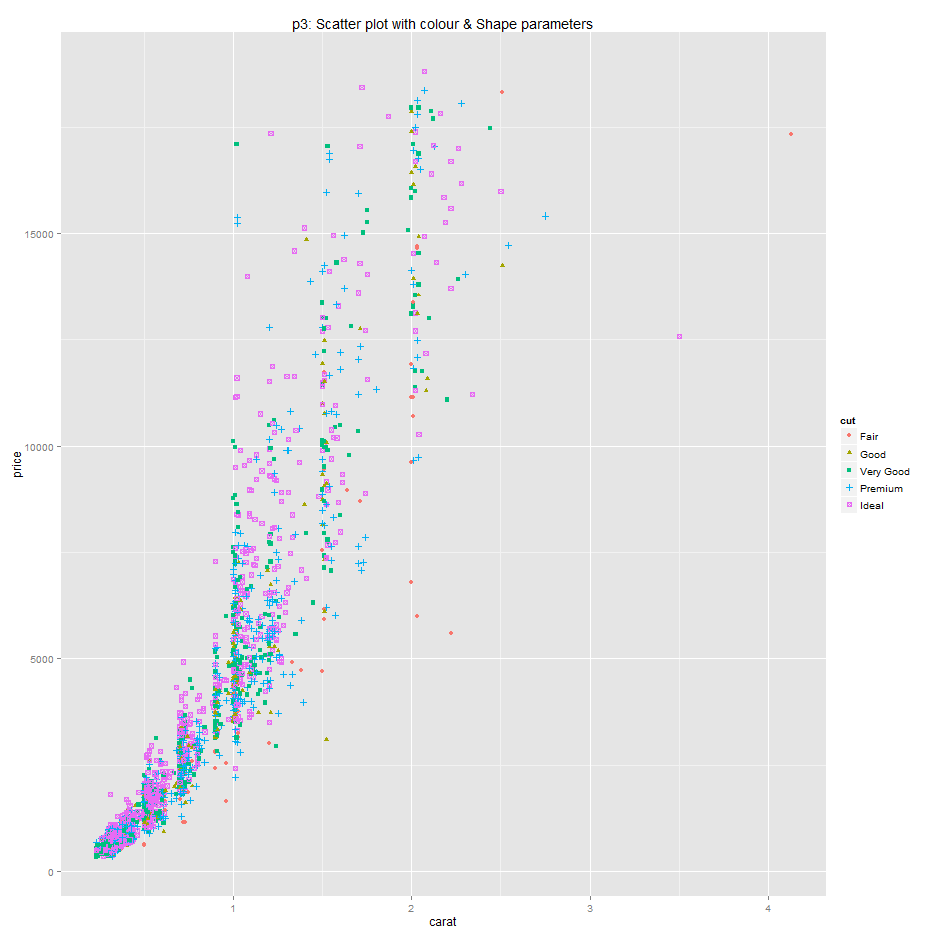
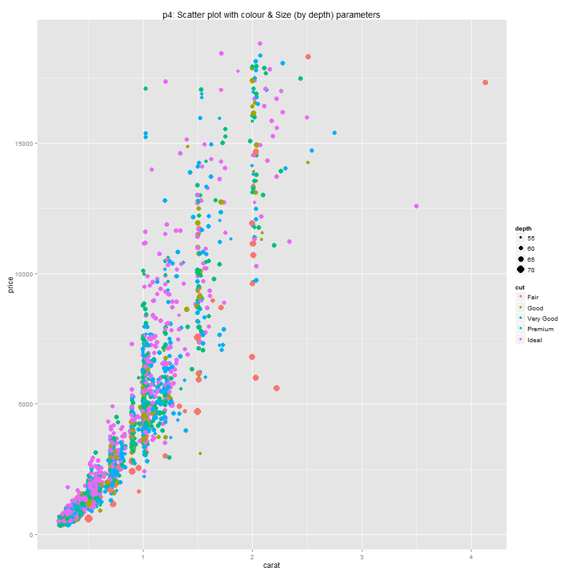
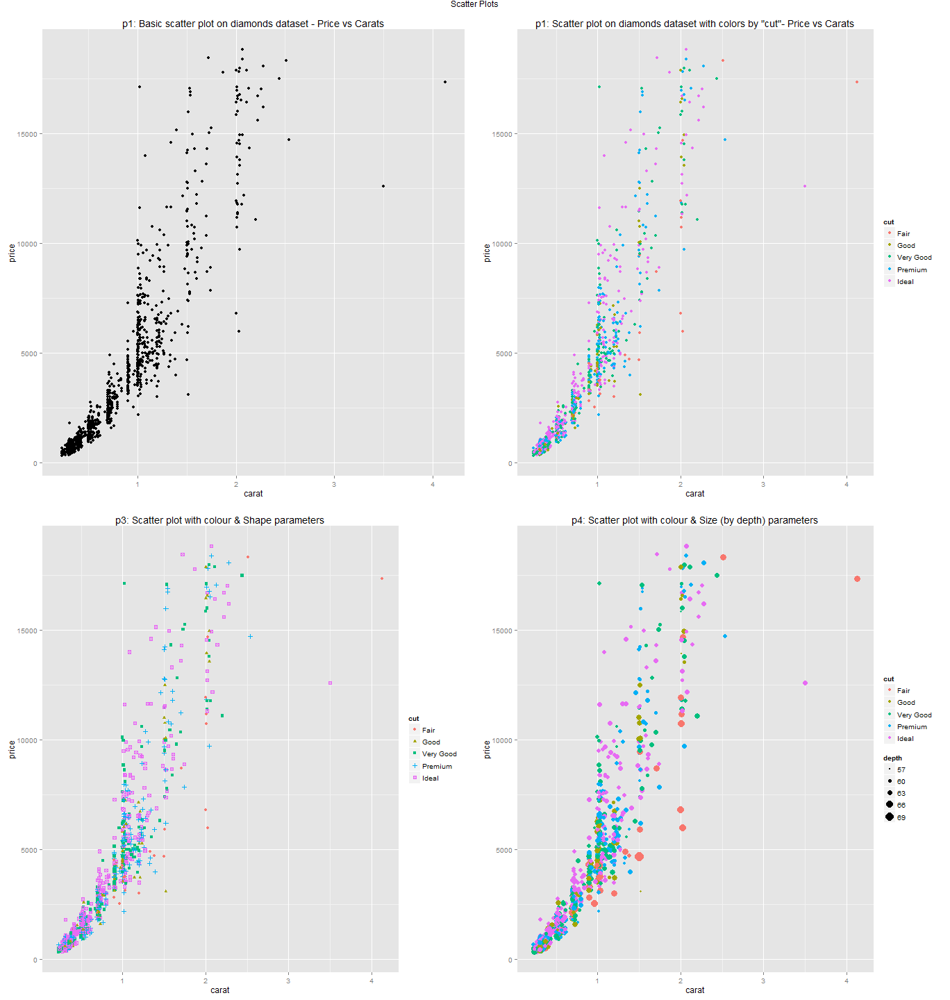
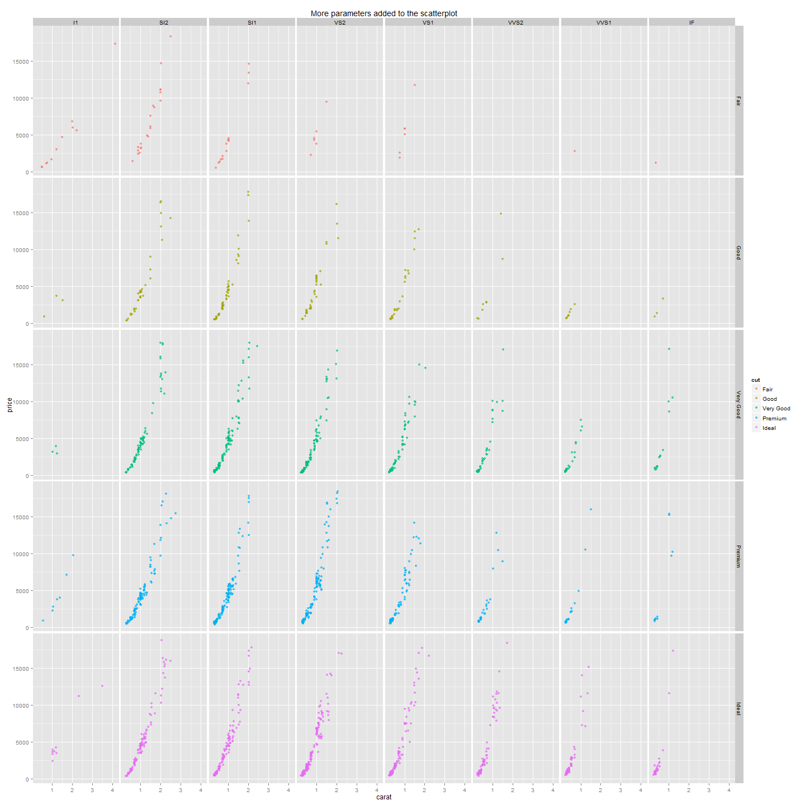

Basic Scatter Plot (*Nothing Very Fancy - yet*)
===============================================

We'll be using the `diamonds` dataset that comes with `ggplot2`.

###Basic Data Summary###

```
Loading required package: ggplot2
Loading required package: gridExtra
Loading required package: grid
```


```r
diamonds<-diamonds
summary(diamonds)
```

```
      carat              cut        color        clarity          depth          table          price             x               y               z        
  Min.   :0.200   Fair     : 1610   D: 6775   SI1    :13065   Min.   :43.0   Min.   :43.0   Min.   :  326   Min.   : 0.00   Min.   : 0.00   Min.   : 0.00  
  1st Qu.:0.400   Good     : 4906   E: 9797   VS2    :12258   1st Qu.:61.0   1st Qu.:56.0   1st Qu.:  950   1st Qu.: 4.71   1st Qu.: 4.72   1st Qu.: 2.91  
  Median :0.700   Very Good:12082   F: 9542   SI2    : 9194   Median :61.8   Median :57.0   Median : 2401   Median : 5.70   Median : 5.71   Median : 3.53  
  Mean   :0.798   Premium  :13791   G:11292   VS1    : 8171   Mean   :61.8   Mean   :57.5   Mean   : 3933   Mean   : 5.73   Mean   : 5.73   Mean   : 3.54  
  3rd Qu.:1.040   Ideal    :21551   H: 8304   VVS2   : 5066   3rd Qu.:62.5   3rd Qu.:59.0   3rd Qu.: 5324   3rd Qu.: 6.54   3rd Qu.: 6.54   3rd Qu.: 4.04  
  Max.   :5.010                     I: 5422   VVS1   : 3655   Max.   :79.0   Max.   :95.0   Max.   :18823   Max.   :10.74   Max.   :58.90   Max.   :31.80  
                                    J: 2808   (Other): 2531
```

```r
colnames(diamonds)
```

```
  [1] "carat"   "cut"     "color"   "clarity" "depth"   "table"   "price"   "x"       "y"       "z"
```

```r
set.seed(56)
data=diamonds[sample(1:nrow(diamonds),2000),]
```


###Plots###

The `ggplot2` package by *Hadley Wickham* follows a layer by layer plot building philosophy. In order to build a plot using `ggplot2` , the ideal way is to think in terms of plotting layers.

The steps involved in creating a plot are as follows:

+**Step 1:** Add dataset:         `ggplot(data)`
+**Step 2:** Add geometry(layer): `geom_point(x,y)`
+**Step 3:** Add Plot title/change axes scales/faceting

####Plot 01####


**Create a basic scatter plot:**
Here:
`data` is a sample of 2000 observations from diamonds dataset.
The `null` plot is initialised by using `ggplot()`
To create a scatterplot, we use `geom_point()` as geometry/layer.
To add plot title we use `ggtitle()`


```r
p1=ggplot(data)+ 
  geom_point(aes(y=price,x=carat))+
  ggtitle('p1: Basic scatter plot on diamonds dataset - Price vs Carats')

p1
```

 

####Plot 02####

To create a scatter plot with colors according to a given factor variable, we use the `color` parameter. It takes in a factor (categorical) variable as input & colors the points according to the components of factor variable.


```r
p2=ggplot(data)+
  geom_point(aes(y=price,x=carat,color=cut))+
  ggtitle('p1: Scatter plot on diamonds dataset with colors by "cut"- Price vs Carats')

p2
```

 

The above plot is exactly same as `p2=p1+geom_point(aes(x=carat,y=price,color=cut))`. If you already have a plot & intend to modify its one aspect using `ggplot2`, you can do it by using the `+` operator along with your plot's layer/geometry specification.


####Plot 03####


```r
p3=ggplot(data)+
  geom_point(aes(y=price,x=carat,color=cut,shape=cut))+
  ggtitle('p3: Scatter plot with colour & Shape parameters')

p3
```

 

####Plot 04####


```r
p4=ggplot(data)+
  geom_point(aes(y=price,x=carat,color=cut,size=depth))+
  ggtitle('p4: Scatter plot with colour & Size (by depth) parameters')

p4
```

 

####Plot 05: Combined plots####


```r
grid.arrange(p1,p2,p3,p4,ncol=2,main='Scatter Plots')
```

 


####Plot 06: Adding Faceting grid####


```r
ggplot(data)+
  geom_point(aes(x=carat,y=price,color=cut),alpha=0.7)+
  facet_grid(facets=cut~clarity)+
  ggtitle('More parameters added to the scatterplot')
```

 
